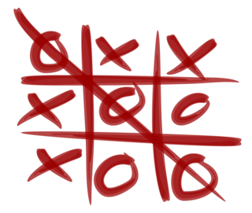

# Juego TIC-TAC-TOE

Juego 3 en raya desarrollado en Typescript con angular 

## Requerimientos:
Requerimientos de la aplicación

### Tablero:
  1. existe la instancia
  2. ... inicialmente
  3. el tablero tiene 9 valores
  4. todos los valores son 0 en el tablero
  5. una posicion se puede marcar cuando su valor es 0
  6. puedo marcar una posición en el tablero
  7. no puedo marcar una posición en el tablero si ya tiene un valor
  8. gana un valor cuando hace tres en raya

### Juego:
  1. existe la instancia
  2. ... inicialmente
  3. las rondas se almacenan en "rounds" se inicia a 0
  4. el juego tiene un tablero
  5. el juego tiene dos jugadores
  6. el juego puede crearse con un jugador
  7. el juego puede crearse con dos jugadores
  8. ... en una ronda"
  9. el jugador 1 elige la posición 0
  10. el jugador 2 elige la posición 1
  11. el jugador 2 elige la posición 1 que ya ha sido elegida
  12. ... desarrollo del juego
  13. El juego se reinicia cuando gana algún jugador

### Jugador 3enRaya:
  1. existe la instancia
  2. se almacena un valor del jugador

### Jugador:
  1. existe la instancia
  2. se almacena el nombre del jugador

## Ejecución

    $ npm start

## Calidad del código

Para lanzar las reglas de calidad del código ejecutar

    $ ng lint

## Test Karma

Desarrollo guiado por Test (TDD)

    $ npm test

Pasada simple del test

    $ ng test --single-run

Cobertura del código

    $ ng test --single-run --code-coverage

## Test e2e

    $ npm run e2e

Levanta un servidor en http://localhost:4200

## Entornos

       ng-build --target=production
       ng-build --target=development

## Instrucciones angular-cli

Scaffold  | Usage
---       | ---
Component | `ng g component my-new-component`
Directive | `ng g directive my-new-directive`
Pipe      | `ng g pipe my-new-pipe`
Service   | `ng g service my-new-service`
Class     | `ng g class my-new-class`
Interface | `ng g interface my-new-interface`
Enum      | `ng g enum my-new-enum`
Module    | `ng g module my-module`
Routing   | `ng g module modules/module-name --routing`

